# A2A Research Agent - Multi-Agent LangGraph Implementation

> A production-ready implementation of the Agent-to-Agent (A2A) Protocol using LangGraph, demonstrating autonomous helpfulness evaluation and clean architectural patterns for AI Engineering.

## What This Project Demonstrates

This repository showcases advanced agent architecture patterns through a **research agent with autonomous quality control**:

- **A2A Protocol Implementation** - Full agent discovery, communication, and streaming
- **Helpfulness Evaluation Loop** - Self-evaluating responses before returning to users
- **Hexagonal Architecture** - Protocol-agnostic core with adapter pattern
- **Production-Grade Patterns** - Type safety, state management, tool integration

### The Helpfulness Innovation

Unlike traditional agents that return responses immediately, this implementation includes a **self-evaluation cycle**:

```
Query → Agent → Tools → Response → Helpfulness Check → Return
         ↑                            ↓ (Not helpful)
         └────────────────────────────┘ (Max 10 iterations)
```

The same LLM judges whether its response is accurate, complete, and uses appropriate tools. This ensures quality before user delivery.

## Understanding A2A Protocol Fundamentals

### Consumer vs Provider Roles

The A2A protocol establishes a **client-server model** where agents discover and collaborate while remaining **opaque** (no shared state, memory, or tools):

```
┌─────────────────────────────────────────────────────────────────┐
│                        Business Analogy                         │
├─────────────────────────────────────────────────────────────────┤
│                                                                 │
│  CONSUMER (Customer)              PROVIDER (Business)           │
│  ─────────────────────            ──────────────────           │
│                                                                 │
│  • Discovers services      ←──→   • Advertises services        │
│  • Places orders                  • Processes orders           │
│  • Receives products              • Delivers products          │
│  • Provides feedback              • Maintains quality          │
│                                                                 │
│  Runs on customer's device        Runs on business servers     │
│                                                                 │
└─────────────────────────────────────────────────────────────────┘
```

**In Our Implementation:**
- **Consumer (Client Agent)** = `a2a_client_examples/` - discovers agents, sends requests, handles responses
- **Provider (Remote Agent)** = `a2a_service/` - advertises capabilities, executes logic, manages task lifecycle

### A2A Protocol Pattern

From the [official A2A documentation](https://github.com/a2aproject/A2A):

```mermaid
graph LR
 User(🧑‍💻 User) <--> ClientAgent(🤖 Client Agent)
 ClientAgent --> A2A1(**↔️ A2A**) --> RemoteAgent1(🤖 Remote Agent 1)
 ClientAgent --> A2A2(**↔️ A2A**) --> RemoteAgent2(🤖 Remote Agent 2)

 style User fill:#fdebd0,stroke:#e67e22,stroke-width:2px
 style ClientAgent fill:#d6eaf8,stroke:#3498db,stroke-width:2px
 style RemoteAgent1 fill:#d6eaf8,stroke:#3498db,stroke-width:2px
 style RemoteAgent2 fill:#d6eaf8,stroke:#3498db,stroke-width:2px
 style A2A1 fill:#ebedef,stroke:#909497,stroke-width:2px
 style A2A2 fill:#ebedef,stroke:#909497,stroke-width:2px
```



**Key Concepts**:
- **Protocol-Mediated Communication**: Standardized JSON-RPC over HTTP
- **Multi-Agent Orchestration**: Client agent coordinates multiple remote agents
- **Discovery-Based**: Agents find each other via AgentCard at `/.well-known/agent.json`

### Quick Reference: Consumer vs Provider Boundaries

| Concern | Consumer (Client Side) | Provider (Server Side) |
|---------|------------------------|------------------------|
| **Discovery** | Fetches AgentCard from `/.well-known/agent.json` | Serves AgentCard at well-known endpoint |
| **Authentication** | Obtains & includes credentials in headers | Validates credentials, returns 401/403 on failure |
| **Message Flow** | Constructs SendMessageRequest | Parses and routes incoming messages |
| **Task Management** | Monitors task states via responses | Creates task_id/context_id, manages lifecycle |
| **Business Logic** | Presents UI, orchestrates workflows | Executes agent logic (LLM, tools, RAG) |
| **Code Location** | `a2a_client_examples/` | `a2a_service/` |
| **Infrastructure** | HTTP client, credential storage | HTTP server, LLM APIs, vector DB, task store |

### Deep Dive: Consumer-Provider Architecture Document

The comprehensive [Consumer-Provider Interaction Architecture](architecture/diagrams/02a_consumer_provider_interaction_architecture_diagrams.md) contains detailed diagrams and explanations:

| Section | Purpose |
|---------|---------|
| **1. Introduction** | Consumer vs Provider definitions, business analogy, A2A protocol context |
| **2. Discovery & Initialization** | 5-phase handshake sequence before data exchange |
| **3. Consumer-Side Architecture** | Client components, responsibilities, data flow diagrams |
| **4. Provider-Side Architecture** | Server components, responsibilities, data flow diagrams |
| **5. Boundary Matrix** | Complete responsibility separation table (18 concerns mapped) |
| **6. Complete Interaction Flow** | End-to-end sequence diagram with all 6 phases |
| **7. Task Lifecycle State Machine** | Task states, transitions, and immutability principles |

**Official A2A Resources**:
- [A2A Protocol Specification](https://github.com/a2aproject/A2A)
- [Official Website](https://a2a-protocol.org)
- [Anthropic A2A Guide](https://docs.claude.com/en/docs/agents/a2a-protocol)

---

## Repository Architecture

```
aie8-s15-a2a-refactored/
│
├── a2a_service/              ⭐ Production implementation (use this)
│   ├── core/                 # Protocol-agnostic business logic
│   │   ├── graph.py          # Pure LangGraph state machine
│   │   ├── agent.py          # Streaming wrapper interface
│   │   ├── tools.py          # Tool implementations
│   │   └── rag_graph.py      # RAG as a tool
│   ├── adapters/             # Protocol-specific translation
│   │   └── agent_executor.py # A2A protocol adapter
│   └── README.md             # Architecture patterns deep-dive
│
├── app/                      # Reference implementation (monolithic)
│   └── README.md             # Original flat structure
│
├── a2a_client_examples/      # Client implementation examples
│   ├── a2a_client_tutorial.ipynb
│   ├── test_client.py
│   └── README.md
│
├── architecture/             # Comprehensive documentation
│   ├── docs/                 # Component inventory, data flows, API
│   ├── diagrams/             # Architecture diagrams
│   └── README.md             # System overview
│
├── ra_*/                     # Repository Analyzer framework (advanced)
│
├── data/                     # RAG document storage (PDFs)
│
├── CLAUDE.md                 # Complete project guide
└── .env.example              # Environment template
```

## Key Architectural Patterns

### 1. The Wrapper Pattern

**Understanding the dual "agent" structure:**

| File | Purpose | Analogy |
|------|---------|---------|
| [core/graph.py](a2a_service/core/graph.py) | Pure LangGraph state machine definition | The engine |
| [core/agent.py](a2a_service/core/agent.py) | Streaming wrapper providing interface | The dashboard |

`graph.py` defines **what the agent does** (nodes, edges, routing logic).
`agent.py` defines **how you interact with it** (streaming, response formatting).

This separation enables reusability - the same graph works with any protocol (A2A, REST, gRPC).

### 2. Hexagonal/Ports and Adapters

**Why `app/` vs `a2a_service/`?**
- `app/` - Original flat implementation (all files at same level)
- `a2a_service/` - Refactored with clean layers (core vs adapters)
- **Use `a2a_service/` for development** - it demonstrates production patterns

### System Architecture

The system follows a 5-layer architecture with clear separation of concerns:


**Key Relationships:**
- **Adapters depend on Core** (not vice versa) - enables protocol flexibility
- **Core is protocol-agnostic** - same graph works with A2A, REST, or gRPC
- **Tools are pre-approved** - execute automatically without human-in-the-loop
- **RAG is a mini-graph** - separate 2-node LangGraph exposed as a tool

## Quick Start

**Prerequisites**: Python 3.13+, OpenAI API key, Tavily API key

```bash
# Setup
uv sync
cp .env.example .env          # Configure API keys
mkdir -p data                 # Optional: for RAG documents

# Run the A2A service
uv run python -m a2a_service

# Test (separate terminal)
uv run python a2a_client_examples/test_client.py
```

**Environment variables** (`.env`):
```bash
OPENAI_API_KEY=sk-proj-your-key-here
TAVILY_API_KEY=tvly-your-key-here     # Optional
TOOL_LLM_NAME=gpt-4o-mini             # Default model
RAG_DATA_DIR=data                      # PDF location
```

## Documentation Map

### Start Here

| Document | When to Read |
|----------|--------------|
| [CLAUDE.md](CLAUDE.md) | Comprehensive guide - patterns, setup, troubleshooting |
| [architecture/README.md](architecture/README.md) | System design, architecture decisions, key findings |
| [a2a_service/README.md](a2a_service/README.md) | Wrapper pattern, extension guide, architecture rationale |

### Detailed Reference

| Document | Purpose |
|----------|---------|
| [architecture/docs/01_component_inventory.md](architecture/docs/01_component_inventory.md) | Complete component catalog with line numbers |
| [architecture/docs/03_data_flows.md](architecture/docs/03_data_flows.md) | Sequence diagrams for request/response flows |
| [architecture/docs/04_api_reference.md](architecture/docs/04_api_reference.md) | API documentation with usage patterns |
| [architecture/diagrams/02_architecture_diagrams.md](architecture/diagrams/02_architecture_diagrams.md) | Visual system architecture |
| [architecture/diagrams/02a_consumer_provider_interaction_architecture_diagrams.md](architecture/diagrams/02a_consumer_provider_interaction_architecture_diagrams.md) | Consumer / Provider interaction |
| [a2a_client_examples/README.md](a2a_client_examples/README.md) | Client implementation and JSON-RPC formats |

### Quick Navigation

**I want to...**

- 🏗️ **Understand the architecture** → [architecture/README.md](architecture/README.md)
- 🔧 **Extend the agent** → [a2a_service/README.md](a2a_service/README.md)
- 📡 **Build a client** → [a2a_client_examples/README.md](a2a_client_examples/README.md)
- 🐛 **Debug issues** → [CLAUDE.md](CLAUDE.md) troubleshooting section

## Common Operations

### Running the Service

```bash
# Default (localhost:10000)
uv run python -m a2a_service

# Custom host/port
uv run python -m a2a_service --host 0.0.0.0 --port 8080

# Verify running
curl http://localhost:10000/.well-known/agent.json
```

### Adding RAG Documents

```bash
# Add PDFs to data directory
cp your-docs/*.pdf data/

# Agent automatically uses RAG tool when appropriate
# Example query: "What do the policies say about eligibility?"
```

### LangGraph Studio

```bash
# Start dev server
uv run langgraph dev

# Access at: https://smith.langchain.com/studio?baseUrl=http://localhost:2024
```

## Learning Objectives

This repository teaches production-grade agent patterns:

### Core Concepts

1. **A2A Protocol** - Agent discovery, communication, streaming responses
2. **State Machines** - LangGraph for stateful workflows with conditional routing
3. **Wrapper Pattern** - Separating graph definition from streaming interface
4. **Hexagonal Architecture** - Protocol-agnostic core with adapters
5. **Autonomous Quality Control** - Self-evaluating helpfulness loops
6. **Multi-Agent Orchestration** - Coordinating specialized agents
7. **Portable Frameworks** - Building reusable, drop-in toolkits

### Recommended Learning Path

```
1. Read architecture/README.md              → Understand the system (30 min)
2. Review a2a_service/README.md             → Learn the patterns (1 hour)
3. Run the agent, test with client          → See it work (30 min)
4. Study core/graph.py and core/agent.py    → Understand wrapper pattern (1 hour)
5. Review adapters/agent_executor.py        → See protocol translation (30 min)
6. Explore ra_orchestrators/                → Learn advanced orchestration (optional)
7. Extend with custom tool                  → Apply knowledge (2-4 hours)
```

### Bootcamp Context

- **Session 05**: Single-agent LangGraph patterns
- **Session 06**: Multi-agent orchestration
- **Session 15**: A2A Protocol implementation (this project)

This project synthesizes concepts from earlier sessions and demonstrates production-ready patterns.

## Technical Details

### Available Tools

- **Tavily Search** - Real-time web search (max 5 results)
- **ArXiv Search** - Academic paper retrieval
- **RAG Retrieval** - Document search via Qdrant vector store

Tools execute automatically (no human-in-the-loop) based on agent decision-making.

### State Management

- **Thread-based context** - `context_id` maintains conversation state
- **MemorySaver checkpointer** - In-memory state persistence
- **Message accumulation** - `add_messages` reducer prevents overwrite
- **Structured responses** - `ResponseFormat` maps to A2A `TaskState`

### Helpfulness Loop Mechanics

```python
# In core/graph.py
def helpfulness_node(state, model):
    if len(state["messages"]) > 10:
        return {"messages": [AIMessage(content="HELPFULNESS:END")]}

    # LLM-as-judge evaluation
    # Returns "HELPFULNESS:Y" (done) or "HELPFULNESS:N" (loop back)
```

**Safeguards**:
- Maximum 10 iterations to prevent infinite loops
- Hard stop with `HELPFULNESS:END` marker
- Router checks for limit markers and terminates

## Project Structure Rationale

### Why Two Implementations?

**`app/` (Original)**:
- Educational reference showing initial design
- All files at same level (flat structure)
- Mixed protocol and business logic

**`a2a_service/` (Refactored)**:
- Production patterns with clear layering
- Separated concerns (core vs adapters)
- Reusable components

Maintaining both demonstrates the evolution from working code to well-architected code.

### Advanced: Repository Analyzer Framework

The `ra_*` directories contain a portable multi-agent orchestration framework for repository analysis. This is an advanced topic demonstrating how to apply agent patterns at scale.

📖 **See**: [ra_orchestrators/README.md](ra_orchestrators/README.md) and [ra_orchestrators/CLAUDE.md](ra_orchestrators/CLAUDE.md)

## Extension Guide

### Adding a Tool

```python
# In a2a_service/core/tools.py
from langchain_core.tools import tool

@tool
def my_custom_tool(query: str) -> str:
    """Tool description for LLM."""
    # Implementation
    return result

# Add to get_tool_belt()
def get_tool_belt() -> List[BaseTool]:
    return [
        TavilySearchResults(max_results=5),
        ArxivQueryRun(),
        retrieve_information,
        my_custom_tool,  # Your tool
    ]
```

### Modifying Graph Logic

Edit [a2a_service/core/graph.py](a2a_service/core/graph.py):
- Add nodes: Define new node functions
- Add edges: Update conditional routing logic
- Update state: Modify `AgentState` TypedDict if needed

Core logic changes don't require adapter modifications.

### Adding a Protocol

```
a2a_service/adapters/
├── agent_executor.py      # Existing A2A adapter
└── rest_adapter.py        # New REST adapter
```

Implement new protocol translation without touching `core/`.

## Version Information

- **Python**: 3.13+
- **LangGraph**: >=0.3.18,<1.0
- **LangChain**: >=0.1.0,<1.0
- **A2A SDK**: >=0.3.0

## External Resources

- **LangGraph**: https://langchain-ai.github.io/langgraph/
- **LangChain**: https://python.langchain.com/
- **A2A Protocol**: https://github.com/anthropics/a2a-sdk-python
- **Tavily API**: https://tavily.com
- **ArXiv API**: https://arxiv.org/help/api

---

**Start exploring**: Begin with [architecture/README.md](architecture/README.md) for system overview, then [a2a_service/README.md](a2a_service/README.md) for implementation patterns.
