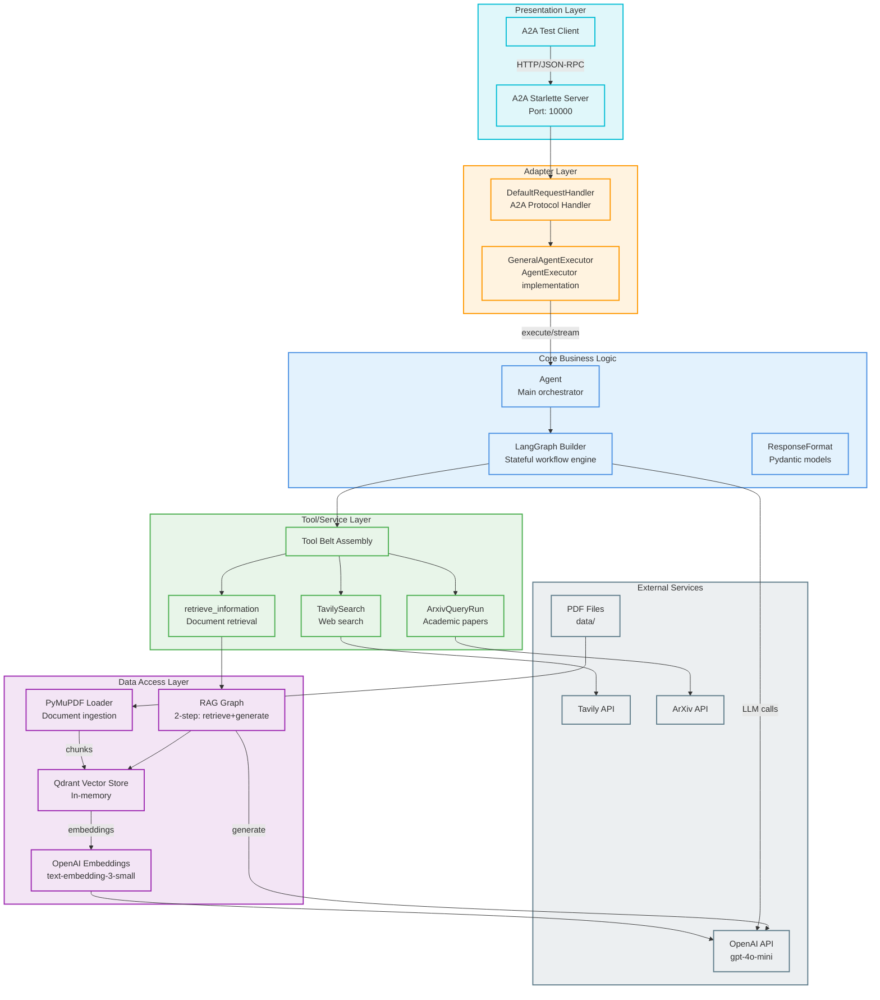
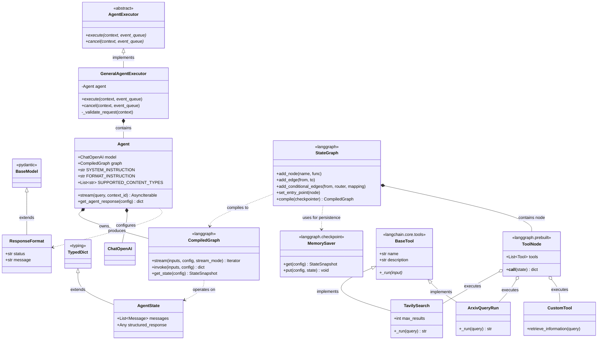
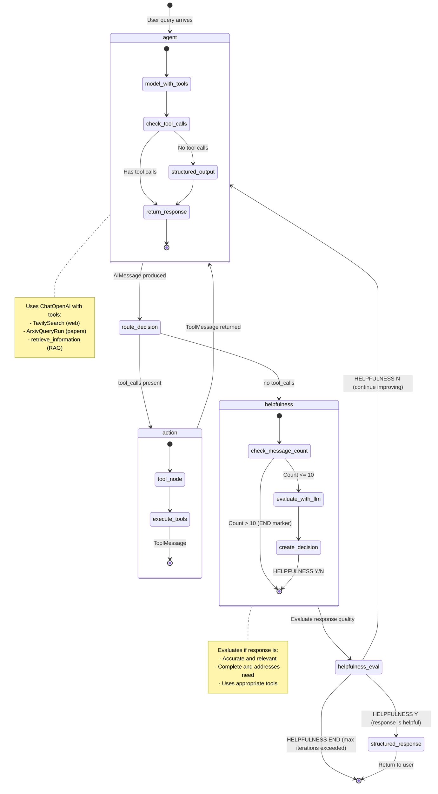
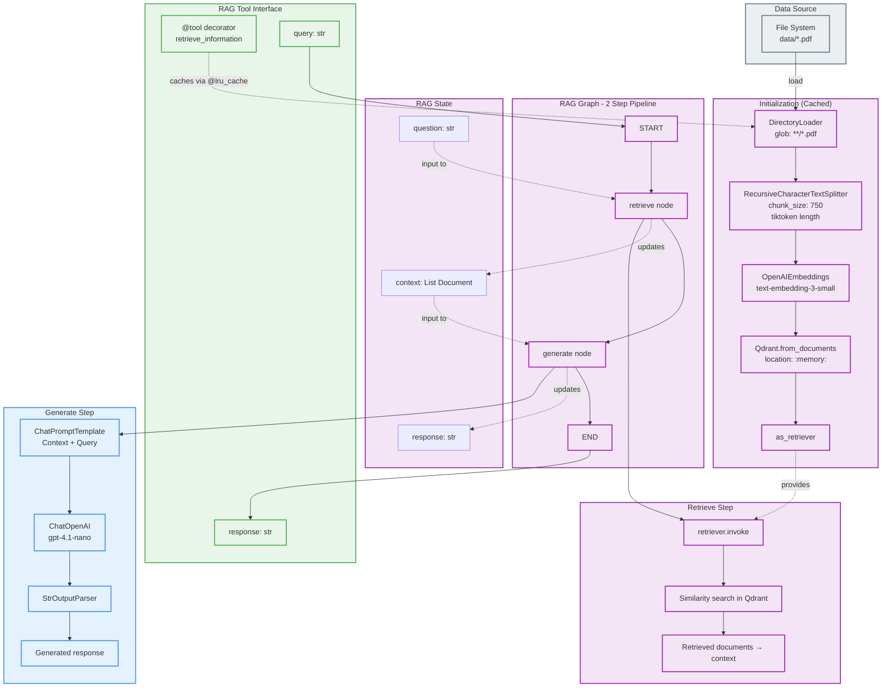
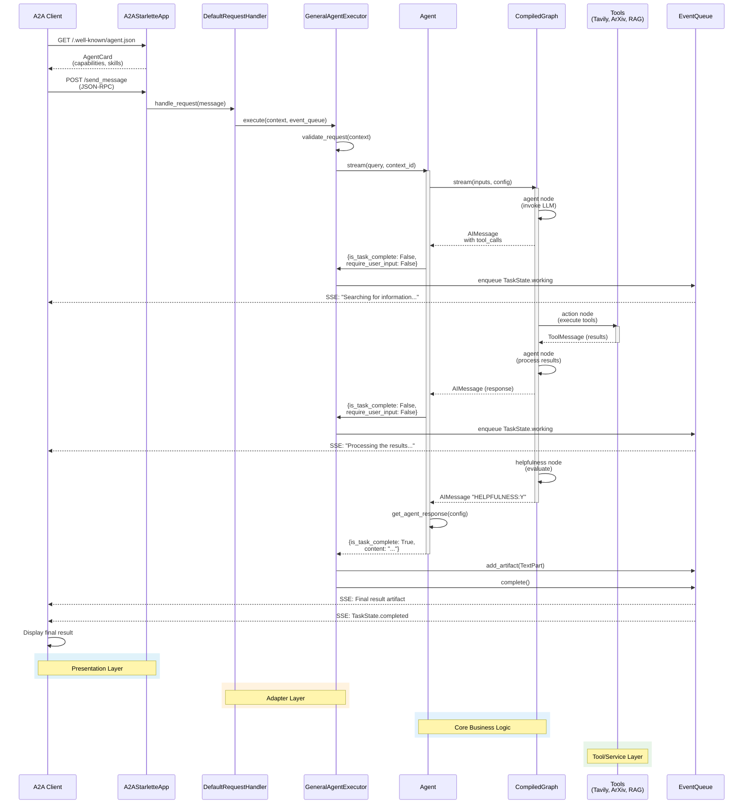
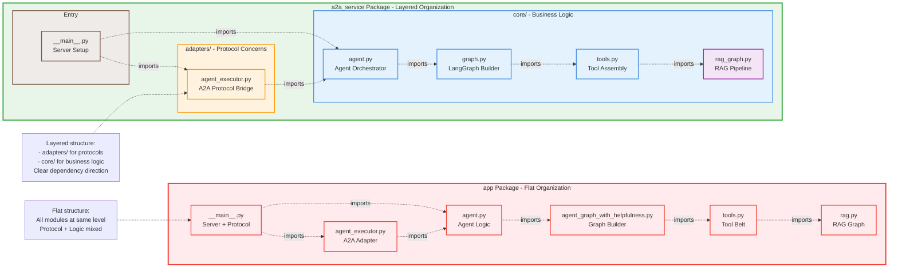

# Architecture Diagrams

## System Architecture

The system follows a layered architecture pattern with clear separation of concerns. There are two implementations present: a legacy `app/` package and a refactored `a2a_service/` package that demonstrates better architectural practices.

**Key Architectural Layers:**
- **Presentation Layer**: A2A protocol server (Starlette-based HTTP server)
- **Adapter Layer**: Protocol-specific adapters (GeneralAgentExecutor) that bridge protocol to core logic
- **Core Business Logic Layer**: Agent, Graph building, and orchestration
- **Tool/Service Layer**: External integrations (Tavily, ArXiv, RAG)
- **Data Access Layer**: RAG with vector store (Qdrant in-memory), PDF loaders

The refactored architecture (`a2a_service/`) demonstrates the Hexagonal/Ports and Adapters pattern, where:
- Core business logic is protocol-agnostic
- Adapters translate between protocols (A2A) and the core domain
- Dependencies point inward (adapters depend on core, not vice versa)



## Component Relationships

The system is organized around a central Agent component that coordinates between the LangGraph state machine and various tools. The Agent to A2A protocol bridge is handled by the GeneralAgentExecutor adapter.

**Key Relationships:**
1. **Agent ↔ Graph**: Agent instantiates and manages the compiled LangGraph, streaming results
2. **Graph ↔ Tools**: Graph binds tools to the LLM and orchestrates tool calls via ToolNode
3. **Executor ↔ Agent**: Executor translates A2A protocol events to/from Agent stream
4. **Graph ↔ Helpfulness**: Post-response evaluation loop ensures quality before completion
5. **RAG Tool ↔ RAG Graph**: RAG tool encapsulates a separate 2-node LangGraph for retrieval+generation

```mermaid
graph LR
    subgraph ENTRY["Server Entry Point"]
        Main["__main__.py"]
    end

    subgraph PROTO["A2A Protocol Layer"]
        A2AApp["A2AStarletteApplication"]
        Handler["DefaultRequestHandler"]
        TaskStore["InMemoryTaskStore"]
        EventQueue["EventQueue"]
    end

    subgraph EXEC["Agent Execution"]
        Executor["GeneralAgentExecutor"]
        TaskUpdater["TaskUpdater"]
    end

    subgraph CORE_LOGIC["Core Agent Logic"]
        Agent["Agent"]
        StreamMethod["stream method"]
        GetResponse["get_agent_response"]
    end

    subgraph GRAPH_ORCH["Graph Orchestration"]
        CompiledGraph["Compiled LangGraph"]
        AgentNode["agent node"]
        ActionNode["action node"]
        HelpNode["helpfulness node"]
        Memory["MemorySaver checkpointer"]
    end

    subgraph TOOL_EXEC["Tool Execution"]
        ToolNode["ToolNode"]
        TavilyTool["Tavily Search"]
        ArxivTool["ArXiv Query"]
        RAGTool["RAG retrieve_information"]
    end

    subgraph MODEL["Model Interaction"]
        ChatOpenAI["ChatOpenAI<br/>with tools bound"]
        StructuredOutput["with_structured_output<br/>ResponseFormat"]
    end

    Main -->|initializes| A2AApp
    Main -->|creates| Handler
    Handler -->|uses| Executor
    Handler -->|manages| TaskStore
    Executor -->|creates| TaskUpdater
    Executor -->|calls| Agent

    Agent -->|owns| CompiledGraph
    Agent -->|invokes| StreamMethod
    StreamMethod -->|streams from| CompiledGraph
    StreamMethod -->|yields| GetResponse

    CompiledGraph -->|contains| AgentNode
    CompiledGraph -->|contains| ActionNode
    CompiledGraph -->|contains| HelpNode
    CompiledGraph -->|persists via| Memory

    AgentNode -->|invokes| ChatOpenAI
    AgentNode -->|structures via| StructuredOutput
    ActionNode -->|executes| ToolNode
    HelpNode -->|evaluates| ChatOpenAI

    ToolNode -->|dispatches to| TavilyTool
    ToolNode -->|dispatches to| ArxivTool
    ToolNode -->|dispatches to| RAGTool

    TaskUpdater -->|publishes to| EventQueue
    EventQueue -->|streams to| A2AApp

    style ENTRY fill:#EFEBE9,stroke:#795548,stroke-width:2px
    style PROTO fill:#FFF3E0,stroke:#FF9800,stroke-width:2px
    style EXEC fill:#FFF3E0,stroke:#FF9800,stroke-width:2px
    style CORE_LOGIC fill:#E3F2FD,stroke:#4A90E2,stroke-width:2px
    style GRAPH_ORCH fill:#E3F2FD,stroke:#4A90E2,stroke-width:2px
    style TOOL_EXEC fill:#E8F5E9,stroke:#4CAF50,stroke-width:2px
    style MODEL fill:#E3F2FD,stroke:#4A90E2,stroke-width:2px

    style Main fill:#EFEBE9,stroke:#795548,stroke-width:2px
    style A2AApp fill:#FFF3E0,stroke:#FF9800,stroke-width:2px
    style Handler fill:#FFF3E0,stroke:#FF9800,stroke-width:2px
    style TaskStore fill:#FFF3E0,stroke:#FF9800,stroke-width:2px
    style EventQueue fill:#FFF3E0,stroke:#FF9800,stroke-width:2px
    style Executor fill:#FFF3E0,stroke:#FF9800,stroke-width:2px
    style TaskUpdater fill:#FFF3E0,stroke:#FF9800,stroke-width:2px
    style Agent fill:#E3F2FD,stroke:#4A90E2,stroke-width:2px
    style StreamMethod fill:#E3F2FD,stroke:#4A90E2,stroke-width:2px
    style GetResponse fill:#E3F2FD,stroke:#4A90E2,stroke-width:2px
    style CompiledGraph fill:#E3F2FD,stroke:#4A90E2,stroke-width:2px
    style AgentNode fill:#E3F2FD,stroke:#4A90E2,stroke-width:2px
    style ActionNode fill:#E3F2FD,stroke:#4A90E2,stroke-width:2px
    style HelpNode fill:#E3F2FD,stroke:#4A90E2,stroke-width:2px
    style Memory fill:#E3F2FD,stroke:#4A90E2,stroke-width:2px
    style ToolNode fill:#E8F5E9,stroke:#4CAF50,stroke-width:2px
    style TavilyTool fill:#E8F5E9,stroke:#4CAF50,stroke-width:2px
    style ArxivTool fill:#E8F5E9,stroke:#4CAF50,stroke-width:2px
    style RAGTool fill:#E8F5E9,stroke:#4CAF50,stroke-width:2px
    style ChatOpenAI fill:#E3F2FD,stroke:#4A90E2,stroke-width:2px
    style StructuredOutput fill:#E3F2FD,stroke:#4A90E2,stroke-width:2px
```



## Class Hierarchies

The codebase demonstrates inheritance from the A2A SDK base classes, with custom implementations for the agent domain. The core Agent class is a standalone orchestrator without inheritance, while the Executor extends the A2A protocol's AgentExecutor base class.

**Key Class Structures:**
- **GeneralAgentExecutor** extends `AgentExecutor` from a2a-sdk to implement protocol-specific execution
- **Agent** is a standalone class that encapsulates ChatOpenAI model and compiled LangGraph
- **ResponseFormat** extends Pydantic's `BaseModel` for structured output validation
- **AgentState** is a TypedDict defining the shape of graph state with message accumulation



## Module Dependencies

The module dependency graph shows clear layering with minimal circular dependencies. The refactored `a2a_service/` package demonstrates better separation between core logic and adapters compared to the legacy `app/` package.

**Import Patterns:**
- `__main__.py` imports from both `core/` and `adapters/`, orchestrating server startup
- `adapters/agent_executor` imports from `core/agent` (adapter → core, correct direction)
- `core/agent` imports from `core/graph` (within core layer)
- `core/graph` imports from `core/tools` (within core layer)
- `core/tools` imports from `core/rag_graph` (within core layer)
- External SDK imports: `a2a`, `langgraph`, `langchain_*`, `openai`

```mermaid
graph TB
    subgraph REFACTORED["a2a_service Package"]
        subgraph ENTRY_PTS["Entry Points"]
            MainService["a2a_service/__main__.py"]
        end

        subgraph ADAPTERS["adapters/ - Protocol Layer"]
            AdapterInit["adapters/__init__.py"]
            AgentExecutor["adapters/agent_executor.py"]
        end

        subgraph CORE_MODS["core/ - Business Logic"]
            CoreInit["core/__init__.py"]
            CoreAgent["core/agent.py"]
            CoreGraph["core/graph.py"]
            CoreTools["core/tools.py"]
            CoreRAG["core/rag_graph.py"]
        end
    end

    subgraph LEGACY["app Package (Legacy)"]
        MainApp["app/__main__.py"]
        AppAgent["app/agent.py"]
        AppExecutor["app/agent_executor.py"]
        AppGraph["app/agent_graph_with_helpfulness.py"]
        AppTools["app/tools.py"]
        AppRAG["app/rag.py"]
        TestClient["app/test_client.py"]
    end

    subgraph CLIENTS["Client Examples"]
        ClientExample["a2a_client_examples/test_client.py"]
    end

    subgraph UTILS["Utilities"]
        Setup["setup.py"]
        CheckEnv["check_env.py"]
    end

    subgraph EXT_DEPS["External Dependencies"]
        A2ASDK["a2a-sdk"]
        LangGraph["langgraph"]
        LangChain["langchain-*"]
        OpenAI["langchain-openai"]
        Tavily["langchain-tavily"]
        Community["langchain-community"]
        Qdrant["qdrant-client"]
        Pydantic["pydantic"]
        Starlette["starlette"]
    end

    MainService --> AgentExecutor
    MainService --> CoreAgent
    MainService --> A2ASDK
    MainService --> Starlette

    AgentExecutor --> CoreAgent
    AgentExecutor --> A2ASDK

    CoreAgent --> CoreGraph
    CoreAgent --> OpenAI
    CoreAgent --> LangGraph
    CoreAgent --> Pydantic

    CoreGraph --> CoreTools
    CoreGraph --> LangGraph
    CoreGraph --> LangChain

    CoreTools --> CoreRAG
    CoreTools --> Tavily
    CoreTools --> Community

    CoreRAG --> OpenAI
    CoreRAG --> Qdrant
    CoreRAG --> LangGraph
    CoreRAG --> LangChain
    CoreRAG --> Community

    MainApp --> AppExecutor
    MainApp --> AppAgent
    MainApp --> A2ASDK
    MainApp --> Starlette

    AppExecutor --> AppAgent
    AppExecutor --> A2ASDK

    AppAgent --> AppGraph
    AppAgent --> OpenAI
    AppAgent --> LangGraph

    AppGraph --> AppTools
    AppGraph --> LangGraph

    AppTools --> AppRAG
    AppTools --> Tavily
    AppTools --> Community

    AppRAG --> OpenAI
    AppRAG --> Qdrant
    AppRAG --> LangGraph

    TestClient --> A2ASDK
    ClientExample --> A2ASDK

    Setup -.->|configures| MainApp
    Setup -.->|configures| MainService
    CheckEnv -.->|validates| MainApp
    CheckEnv -.->|validates| MainService

    style REFACTORED fill:#E8F5E9,stroke:#4CAF50,stroke-width:3px
    style LEGACY fill:#FFEBEE,stroke:#F44336,stroke-width:3px
    style CLIENTS fill:#E0F7FA,stroke:#00BCD4,stroke-width:2px
    style UTILS fill:#FFF3E0,stroke:#FF9800,stroke-width:2px
    style EXT_DEPS fill:#ECEFF1,stroke:#607D8B,stroke-width:2px

    style ENTRY_PTS fill:#EFEBE9,stroke:#795548,stroke-width:2px
    style ADAPTERS fill:#FFF3E0,stroke:#FF9800,stroke-width:2px
    style CORE_MODS fill:#E3F2FD,stroke:#4A90E2,stroke-width:2px

    style CoreAgent fill:#E3F2FD,stroke:#4A90E2,stroke-width:2px
    style CoreGraph fill:#E3F2FD,stroke:#4A90E2,stroke-width:2px
    style CoreTools fill:#E3F2FD,stroke:#4A90E2,stroke-width:2px
    style CoreRAG fill:#F3E5F5,stroke:#9C27B0,stroke-width:2px
    style AgentExecutor fill:#FFF3E0,stroke:#FF9800,stroke-width:2px
    style MainService fill:#EFEBE9,stroke:#795548,stroke-width:2px

    style AppAgent fill:#FFEBEE,stroke:#F44336,stroke-width:2px
    style AppGraph fill:#FFEBEE,stroke:#F44336,stroke-width:2px
    style AppExecutor fill:#FFEBEE,stroke:#F44336,stroke-width:2px
    style AppTools fill:#FFEBEE,stroke:#F44336,stroke-width:2px
    style AppRAG fill:#FFEBEE,stroke:#F44336,stroke-width:2px
    style MainApp fill:#FFEBEE,stroke:#F44336,stroke-width:2px
```



## LangGraph State Machine Flow

The agent uses a sophisticated LangGraph state machine with a helpfulness evaluation loop. This ensures responses meet quality standards before returning to the user.

**Graph Structure:**
1. **Entry Point**: "agent" node receives user messages
2. **Agent Node**: Invokes LLM with bound tools, produces AIMessage
3. **Routing Decision**: If tool calls needed → "action", else → "helpfulness"
4. **Action Node**: Executes tools via ToolNode, returns ToolMessages
5. **Helpfulness Node**: Evaluates response quality (Y/N decision)
6. **Helpfulness Decision**: If Y → END, if N → back to "agent" (max 10 iterations)



## RAG Architecture Detail

The RAG (Retrieval-Augmented Generation) system is implemented as a separate mini-LangGraph exposed as a tool. It demonstrates a clean two-step pattern: retrieve → generate.

**RAG Components:**
1. **Document Loading**: PyMuPDFLoader recursively loads PDFs from `RAG_DATA_DIR`
2. **Text Splitting**: RecursiveCharacterTextSplitter with tiktoken-based length (750 tokens)
3. **Embedding**: OpenAI's text-embedding-3-small model
4. **Vector Store**: Qdrant in-memory (location=":memory:")
5. **Retrieval**: Similarity search via Qdrant retriever
6. **Generation**: ChatOpenAI with constrained context prompt



## A2A Protocol Integration

The A2A (Agent-to-Agent) protocol integration demonstrates the Adapter pattern, translating between the protocol's event-driven streaming model and the core Agent's streaming interface.

**Integration Points:**
1. **AgentCard**: Metadata describing agent capabilities and skills
2. **DefaultRequestHandler**: Handles HTTP requests, manages tasks and push notifications
3. **GeneralAgentExecutor**: Bridges A2A protocol to Agent.stream()
4. **TaskUpdater**: Publishes state transitions to EventQueue
5. **EventQueue**: Streams updates back to client via SSE (Server-Sent Events)



## File Organization Comparison

The codebase contains two implementations side-by-side: the original `app/` package and the refactored `a2a_service/` package. This comparison highlights architectural improvements.

**app/ Package (Original - Flat Structure):**
```
app/
├── __init__.py          (minimal)
├── __main__.py          (server entry, A2A setup)
├── agent.py             (Agent class)
├── agent_executor.py    (GeneralAgentExecutor)
├── agent_graph_with_helpfulness.py (graph builder)
├── tools.py             (tool assembly)
├── rag.py               (RAG graph)
└── test_client.py       (test client)
```

**a2a_service/ Package (Refactored - Layered Structure):**
```
a2a_service/
├── __init__.py          (package exports)
├── __main__.py          (server entry)
├── adapters/            (Protocol Layer)
│   ├── __init__.py
│   └── agent_executor.py (A2A → Core bridge)
└── core/                (Business Logic Layer)
    ├── __init__.py
    ├── agent.py         (Agent orchestrator)
    ├── graph.py         (graph builder)
    ├── tools.py         (tool assembly)
    └── rag_graph.py     (RAG implementation)
```



## Configuration and Environment

The application uses environment-based configuration with validation utilities. Configuration is loaded via python-dotenv and validated before server startup.

**Configuration Files:**
- `.env` - Environment variables (API keys, model config, RAG settings)
- `.env.example` - Template for required configuration
- `setup.py` - Interactive setup wizard
- `check_env.py` - Configuration validation utility

```mermaid
graph TB
    subgraph CONFIG_MGMT["Configuration Management"]
        EnvFile[".env file"]
        EnvExample[".env.example<br/>Template"]
        Setup["setup.py<br/>Interactive wizard"]
        Check["check_env.py<br/>Validation"]
    end

    subgraph ENV_VARS["Environment Variables"]
        OAIKEY["OPENAI_API_KEY<br/>Required for LLM + embeddings"]
        TavilyKey["TAVILY_API_KEY<br/>Required for web search"]
        LLMName["TOOL_LLM_NAME<br/>Default: gpt-4o-mini"]
        LLMURL["TOOL_LLM_URL<br/>Default: api.openai.com"]
        ChatModel["OPENAI_CHAT_MODEL<br/>Default: gpt-4.1-nano"]
        DataDir["RAG_DATA_DIR<br/>Default: data/"]
    end

    subgraph APP_COMP["Application Components"]
        Main["__main__.py"]
        Agent["Agent.__init__"]
        RAG["RAG _build_rag_graph"]
        Tools["get_tool_belt"]
    end

    subgraph EXT_SERV["External Services"]
        OpenAI["OpenAI API"]
        Tavily["Tavily API"]
    end

    Setup -->|creates| EnvFile
    EnvExample -.->|template for| Setup
    Check -->|validates| EnvFile

    EnvFile --> OAIKEY
    EnvFile --> TavilyKey
    EnvFile --> LLMName
    EnvFile --> LLMURL
    EnvFile --> ChatModel
    EnvFile --> DataDir

    Main -->|checks| OAIKEY
    Agent -->|uses| OAIKEY
    Agent -->|uses| LLMName
    Agent -->|uses| LLMURL

    RAG -->|uses| OAIKEY
    RAG -->|uses| ChatModel
    RAG -->|uses| DataDir

    Tools -->|uses| TavilyKey

    Agent -->|authenticates| OpenAI
    RAG -->|authenticates| OpenAI
    Tools -->|authenticates| Tavily

    style CONFIG_MGMT fill:#FFF3E0,stroke:#FF9800,stroke-width:2px
    style ENV_VARS fill:#FFF3E0,stroke:#FF9800,stroke-width:2px
    style APP_COMP fill:#E3F2FD,stroke:#4A90E2,stroke-width:2px
    style EXT_SERV fill:#ECEFF1,stroke:#607D8B,stroke-width:2px

    style EnvFile fill:#FFF3E0,stroke:#FF9800,stroke-width:2px
    style EnvExample fill:#FFF3E0,stroke:#FF9800,stroke-width:2px
    style Setup fill:#FFF3E0,stroke:#FF9800,stroke-width:2px
    style Check fill:#FFF3E0,stroke:#FF9800,stroke-width:2px
    style OAIKEY fill:#FFF3E0,stroke:#FF9800,stroke-width:2px
    style TavilyKey fill:#FFF3E0,stroke:#FF9800,stroke-width:2px
    style LLMName fill:#FFF3E0,stroke:#FF9800,stroke-width:2px
    style LLMURL fill:#FFF3E0,stroke:#FF9800,stroke-width:2px
    style ChatModel fill:#FFF3E0,stroke:#FF9800,stroke-width:2px
    style DataDir fill:#FFF3E0,stroke:#FF9800,stroke-width:2px
    style Main fill:#EFEBE9,stroke:#795548,stroke-width:2px
    style Agent fill:#E3F2FD,stroke:#4A90E2,stroke-width:2px
    style RAG fill:#F3E5F5,stroke:#9C27B0,stroke-width:2px
    style Tools fill:#E8F5E9,stroke:#4CAF50,stroke-width:2px
    style OpenAI fill:#ECEFF1,stroke:#607D8B,stroke-width:2px
    style Tavily fill:#ECEFF1,stroke:#607D8B,stroke-width:2px
```



## Summary

The architecture demonstrates:

1. **Hexagonal/Ports and Adapters Pattern** (in `a2a_service/`): Clean separation between core business logic and protocol adapters
2. **Stateful Workflow Orchestration**: LangGraph manages complex conversation flow with helpfulness evaluation
3. **Tool Abstraction**: Unified interface for multiple data sources (web, academic, documents)
4. **RAG as a Mini-Graph**: Encapsulated retrieval-generation pipeline exposed as a tool
5. **Protocol-Agnostic Core**: Business logic independent of A2A protocol (could swap to REST/gRPC)
6. **Event-Driven Streaming**: A2A's event queue enables real-time progress updates to clients
7. **Configuration as Code**: Environment-based config with validation utilities

The refactored `a2a_service/` package shows significant architectural improvements over the original `app/` package, with better testability, maintainability, and adherence to SOLID principles.
