# Consumer-Provider Interaction Architecture Diagrams

## Executive Summary

This document provides comprehensive architectural diagrams showing the **clear separation between Consumer (Client) and Provider (Server)** functionality in the A2A (Agent-to-Agent) protocol implementation.

**Business Perspective:**
- **Consumer = Customer** - The application/agent that consumes services
- **Provider = Business** - The agent service that provides capabilities

**Key Architectural Principle:**
The A2A protocol establishes a **client-server model** where agents discover each other's capabilities and collaborate while remaining **opaque** (not sharing internal state, memory, or tools).

## Document Purpose

This document focuses on:

1. **Consumer-Side Code** - What runs on the client that consumes the service (`a2a_client_examples/`)
2. **Provider-Side Code** - What runs on the server that provides the agent service (`a2a_service/`)
3. **Initialization Sequence** - The handshake steps before data exchange occurs
4. **Interaction Patterns** - How messages flow between consumer and provider
5. **Clear Boundaries** - Explicit separation of responsibilities

## Related Documentation

### A2A Protocol Official Resources
- **A2A Protocol Specification**: [A2A Project on GitHub](https://github.com/a2aproject/A2A)
- **Official Website**: [a2a-protocol.org](https://a2a-protocol.org)
- **Anthropic A2A Guide**: [docs.claude.com/agents/a2a-protocol](https://docs.claude.com/en/docs/agents/a2a-protocol)
- **Python SDK**: [a2a-sdk-python](https://github.com/anthropics/a2a-sdk-python)

### Implementation Documentation
- **Data Flows**: [architecture/docs/03_data_flows.md](../docs/03_data_flows.md)
- **System Architecture**: [architecture/diagrams/02_architecture_diagrams.md](02_architecture_diagrams.md)
- **API Reference**: [architecture/docs/04_api_reference.md](../docs/04_api_reference.md)
- **Component Inventory**: [architecture/docs/01_component_inventory.md](../docs/01_component_inventory.md)

---

## Table of Contents

1. [Introduction: Consumer vs Provider](#1-introduction-consumer-vs-provider)
2. [Discovery & Initialization Sequence](#2-discovery--initialization-sequence)
3. [Consumer-Side Architecture](#3-consumer-side-architecture)
4. [Provider-Side Architecture](#4-provider-side-architecture)
5. [Boundary Matrix](#5-boundary-matrix)
6. [Complete Interaction Flow](#6-complete-interaction-flow)
7. [Task Lifecycle State Machine](#7-task-lifecycle-state-machine)

---

## 1. Introduction: Consumer vs Provider

### Definitions

**Consumer (A2A Client)**
- **Role**: Initiates requests on behalf of a user or system
- **Runs On**: Client-side application, user's infrastructure
- **Code Location**: [`a2a_client_examples/test_client.py`](../../a2a_client_examples/test_client.py)
- **Responsibilities**:
  - Discover available agents via AgentCard
  - Initialize client with appropriate transport
  - Construct and send messages
  - Handle responses and task states
  - Maintain conversation context

**Provider (A2A Server / Remote Agent)**
- **Role**: Exposes capabilities via HTTP endpoint to process tasks
- **Runs On**: Server-side infrastructure, service provider's environment
- **Code Location**: [`a2a_service/`](../../a2a_service/) directory
- **Responsibilities**:
  - Publish AgentCard at `/.well-known/agent.json`
  - Authenticate incoming requests
  - Execute agent logic (LLM, tools, workflows)
  - Manage task lifecycle and state
  - Stream responses and updates

### Business Analogy

```
┌─────────────────────────────────────────────────────────────────┐
│                        Business Analogy                         │
├─────────────────────────────────────────────────────────────────┤
│                                                                 │
│  CONSUMER (Customer)              PROVIDER (Business)           │
│  ─────────────────────            ──────────────────           │
│                                                                 │
│  • Discovers services      ←──→   • Advertises services        │
│  • Places orders                  • Processes orders           │
│  • Receives products              • Delivers products          │
│  • Provides feedback              • Maintains quality          │
│                                                                 │
│  Runs on customer's device        Runs on business servers     │
│                                                                 │
└─────────────────────────────────────────────────────────────────┘
```

### A2A Protocol Context

The A2A protocol is an **open standard** (originally created by Google, now under Linux Foundation) that:
- Enables AI agents to communicate as **independent agents**, not just tools
- Uses **JSON-RPC 2.0 over HTTP(S)** with Server-Sent Events (SSE) for streaming
- Maintains agent **opacity** - no shared state, memory, or tools
- Complements **MCP** (Model Context Protocol):
  - **MCP**: Connects agent → tools/data
  - **A2A**: Connects agent → agent

### A2A Protocol Architecture Overview

The following diagram from the [A2A Protocol documentation](https://github.com/a2aproject/A2A/blob/main/docs/index.md) illustrates the fundamental architecture:

```mermaid
graph LR
 User(🧑‍💻 User) <--> ClientAgent(🤖 Client Agent)
 ClientAgent --> A2A1(**↔️ A2A**) --> RemoteAgent1(🤖 Remote Agent 1)
 ClientAgent --> A2A2(**↔️ A2A**) --> RemoteAgent2(🤖 Remote Agent 2)

 style User fill:#fdebd0,stroke:#e67e22,stroke-width:2px
 style ClientAgent fill:#d6eaf8,stroke:#3498db,stroke-width:2px
 style RemoteAgent1 fill:#d6eaf8,stroke:#3498db,stroke-width:2px
 style RemoteAgent2 fill:#d6eaf8,stroke:#3498db,stroke-width:2px
 style A2A1 fill:#ebedef,stroke:#909497,stroke-width:2px
 style A2A2 fill:#ebedef,stroke:#909497,stroke-width:2px
```



**Key Concepts Illustrated:**
- **User → Client Agent**: Bidirectional communication between user and primary agent
- **Client Agent → Remote Agents**: Multi-agent delegation through A2A protocol
- **Protocol-Mediated Connections**: Standardized A2A enables interoperability
- **Distributed Orchestration**: Client agent coordinates multiple remote agents

**In Our Implementation:**
- **Client Agent** = Consumer side ([`a2a_client_examples/test_client.py`](../../a2a_client_examples/test_client.py))
- **Remote Agent** = Provider side ([`a2a_service/`](../../a2a_service/))
- **A2A Protocol** = JSON-RPC over HTTP with AgentCard discovery

### Official A2A Resources

- **Protocol Specification**: [A2A Project on GitHub](https://github.com/a2aproject/A2A)
- **Official Website**: [a2a-protocol.org](https://a2a-protocol.org)
- **Anthropic Documentation**: [docs.claude.com/agents/a2a-protocol](https://docs.claude.com/en/docs/agents/a2a-protocol)
- **SDK**: [a2a-sdk-python](https://github.com/anthropics/a2a-sdk-python)

---

## 2. Discovery & Initialization Sequence

### Phase Overview

Before any data exchange occurs, the consumer must:
1. **Discover** the provider agent's capabilities
2. **Authenticate** (obtain credentials out-of-band)
3. **Initialize** the A2A client
4. **Establish** first connection with handshake

### Discovery & Initialization Diagram


### Code References

**Consumer Discovery (Client Side):**
- File: [`a2a_client_examples/test_client.py`](../../a2a_client_examples/test_client.py)
- Lines 32-57: AgentCard resolution and fetching
- Lines 111-119: ClientFactory creation

**Provider AgentCard (Server Side):**
- File: [`a2a_service/__main__.py`](../../a2a_service/__main__.py)
- Lines 43-72: AgentCard definition with capabilities and skills

**First Request Handling (Server Side):**
- File: [`a2a_service/adapters/agent_executor.py`](../../a2a_service/adapters/agent_executor.py)
- Lines 33-50: Request parsing and task creation

---

## 3. Consumer-Side Architecture

### Consumer Components Diagram


### Consumer Responsibilities

| Component | Responsibility | Code Reference |
|-----------|----------------|----------------|
| **A2ACardResolver** | Fetch and parse AgentCard from provider | `test_client.py:32-57` |
| **ClientFactory** | Initialize A2A client with correct transport | `test_client.py:111-119` |
| **Message Builder** | Construct valid A2A messages with proper structure | `test_client.py:122-133, 140-176` |
| **Context Tracker** | Maintain task_id and context_id for multi-turn | `test_client.py:160-161, 168-169` |
| **Response Handler** | Process TaskState and extract artifacts | `test_client.py:135-136, 178-179` |
| **HTTP Client** | Manage connections, timeouts, auth headers | `test_client.py:31` |

### Consumer-Side Data Flow

```
User Input
   ↓
Message Builder (construct A2A message)
   ↓
A2A Client (add auth headers)
   ↓
HTTP Client (POST /jsonrpc)
   ↓
[Network]
   ↓
Response Handler (parse TaskState)
   ↓
Context Tracker (store task_id, context_id)
   ↓
User Output
```

---

## 4. Provider-Side Architecture

### Provider Components Diagram


### Provider Responsibilities

| Component | Responsibility | Code Reference |
|-----------|----------------|----------------|
| **AgentCard** | Publish capabilities, skills, auth requirements | `__main__.py:43-72` |
| **A2AStarletteApplication** | HTTP server for A2A protocol endpoints | `__main__.py:85-99` |
| **DefaultRequestHandler** | Route JSON-RPC requests to executor | `__main__.py:89-94` |
| **GeneralAgentExecutor** | Translate A2A protocol ↔ Core Agent | `agent_executor.py:1-94` |
| **InMemoryTaskStore** | Store and retrieve task states | `__main__.py:86` |
| **EventQueue** | Stream updates via SSE | `agent_executor.py:76-81` |
| **Agent** | Orchestrate LangGraph workflow | `core/agent.py:1-114` |
| **LangGraph** | State machine for agent logic | `core/graph.py:1-164` |
| **Tool Belt** | Manage available tools | `core/tools.py:1-19` |
| **RAG Graph** | Document retrieval and generation | `core/rag_graph.py:1-126` |

### Provider-Side Data Flow

```
HTTP Request
   ↓
A2AStarletteApplication (parse JSON-RPC)
   ↓
DefaultRequestHandler (validate request)
   ↓
GeneralAgentExecutor (A2A → Core translation)
   ↓
Agent.stream() (orchestrate workflow)
   ↓
LangGraph (execute state machine)
   ↓
Tools (TavilySearch, ArxivQueryRun, RAG)
   ↓
LangGraph (synthesize response)
   ↓
Agent (format response)
   ↓
GeneralAgentExecutor (Core → A2A translation)
   ↓
EventQueue (stream updates)
   ↓
HTTP Response (SSE stream or final JSON)
```

---

## 5. Boundary Matrix

### Responsibility Separation Table

| Concern | Consumer Responsibility (Client Side) | Provider Responsibility (Server Side) |
|---------|--------------------------------------|--------------------------------------|
| **Discovery** | Fetch AgentCard from `/.well-known/agent.json` | Serve AgentCard at well-known endpoint |
| **Transport Selection** | Parse AgentCard, select transport (JSONRPC/GRPC/HTTP) | Declare available transports in AgentCard |
| **Authentication (Credentials)** | Obtain credentials from IdP, include in headers | Validate credentials, return 401/403 on failure |
| **Authentication (Validation)** | N/A | Parse `Authorization` header, verify token/API key |
| **Message Construction** | Build SendMessageRequest with proper structure | Parse MessageSendParams from JSON-RPC |
| **Message Routing** | Send to correct endpoint (`/jsonrpc`) | Route to appropriate handler based on method |
| **Task Creation** | N/A | Generate unique task_id and context_id |
| **Task Tracking** | Monitor task states via responses | Manage task lifecycle (pending → working → completed) |
| **Context Management** | Send context_id in follow-up requests | Maintain context across tasks with same context_id |
| **State Persistence** | Store task_id + context_id locally | Persist conversation history in MemorySaver |
| **Streaming** | Handle SSE events, parse incremental updates | Publish events to EventQueue, stream via SSE |
| **Business Logic** | Present UI, orchestrate multi-agent workflows | Execute agent logic (LLM, tools, RAG) |
| **Tool Execution** | N/A | Invoke tools (TavilySearch, ArxivQueryRun, RAG) |
| **Error Handling** | Retry, fallback, notify user | Return standardized A2A errors (InvalidParamsError, etc.) |
| **Data Storage** | Client-side conversation history (optional) | Server-side task store, checkpoints |
| **Artifact Generation** | N/A | Create artifacts (text, files) in response |
| **Artifact Consumption** | Parse and display artifacts to user | N/A |
| **Push Notifications** | Setup webhook receiver (if using push) | Send webhook notifications to consumer |

### Code Location Matrix

| Concern | Consumer Code Location | Provider Code Location |
|---------|------------------------|------------------------|
| **Discovery** | `test_client.py:32-57` | `__main__.py:43-72` |
| **Client Init** | `test_client.py:111-119` | N/A |
| **Server Init** | N/A | `__main__.py:85-99` |
| **Message Construction** | `test_client.py:122-176` | N/A |
| **Message Parsing** | N/A | `agent_executor.py:42` |
| **Request Handling** | N/A | `agent_executor.py:33-50` |
| **Agent Execution** | N/A | `core/agent.py:57-80` |
| **Graph Workflow** | N/A | `core/graph.py:143-164` |
| **Tool Management** | N/A | `core/tools.py:15-18` |
| **Response Processing** | `test_client.py:135-136, 178-179` | N/A |
| **Context Tracking** | `test_client.py:160-161, 168-169` | `agent_executor.py:42-46` |
| **Streaming** | `test_client.py:188-191` | `agent_executor.py:76-81` |

### Infrastructure Boundary

**Consumer Infrastructure (What Customer Deploys):**
- Client application server (if web app)
- HTTP client libraries (`httpx`, `a2a-sdk`)
- Credential storage (secure vault)
- Optional: Webhook receiver for push notifications
- Optional: Client-side conversation history database

**Provider Infrastructure (What Business Deploys):**
- HTTP(S) server with TLS (Uvicorn + Starlette)
- A2A protocol implementation (`a2a-sdk` server)
- Agent execution environment (Python runtime)
- LLM API access (OpenAI credentials)
- Tool API access (Tavily credentials)
- Task store (in-memory or persistent database)
- Vector database (if using RAG - Qdrant)
- Monitoring/logging systems
- Load balancer / API gateway (production)

---

## 6. Complete Interaction Flow

### End-to-End Sequence Diagram


### Flow Phases Explained

**Phase 1: Discovery (Consumer-Driven)**
- Consumer knows provider base URL (config, registry, or user input)
- Consumer fetches AgentCard to understand capabilities
- No provider action beyond serving static AgentCard

**Phase 2: Authentication (Out-of-Band)**
- Consumer obtains credentials from external Identity Provider
- No A2A protocol involvement - uses standard OAuth/API key flows
- Provider validates credentials on first request

**Phase 3: Client Initialization (Consumer-Side Only)**
- Consumer creates A2A client library instance
- Selects transport based on AgentCard preferences
- No provider interaction yet

**Phase 4: First Request - Task Creation (Bidirectional)**
- Consumer sends first message to provider
- **Provider creates task_id and context_id** (critical handshake)
- Provider executes agent logic and returns result
- Consumer stores IDs for subsequent requests

**Phase 5: Multi-Turn Continuation (Bidirectional)**
- Consumer includes task_id and context_id in follow-up
- Provider loads conversation history from checkpointer
- Context maintained across requests via context_id

**Phase 6: Streaming (Optional, Provider Push)**
- Provider streams incremental updates via SSE
- Consumer handles events in real-time
- Final completion signaled with `TaskState.completed`

---

## 7. Task Lifecycle State Machine

### Task State Diagram

```mermaid
stateDiagram-v2
    [*] --> pending: Task created

    pending --> working: Executor starts processing

    working --> completed: Task succeeds
    working --> failed: Execution error
    working --> canceled: Client cancels
    working --> rejected: Agent rejects
    working --> input_required: Need user input
    working --> auth_required: Need auth

    input_required --> working: User provides input
    auth_required --> working: Credentials provided

    completed --> [*]: Terminal state
    failed --> [*]: Terminal state
    canceled --> [*]: Terminal state
    rejected --> [*]: Terminal state

    note right of pending
        Initial state when
        task created by provider
    end note

    note right of working
        Agent actively processing:
        • Calling LLM
        • Executing tools
        • Streaming updates
    end note

    note right of input_required
        Interrupted state:
        • Need clarification
        • Ambiguous query
        • Multi-step flow

        New task created
        on continuation
    end note

    note right of completed
        Terminal state:
        • Artifacts available
        • Cannot restart
        • Follow-up creates
          new task with
          same context_id
    end note
```



### State Definitions

| State | Description | Who Sets | Code Reference |
|-------|-------------|----------|----------------|
| **pending** | Initial state, queued for processing | Provider (Executor) | `agent_executor.py:42` (new_task) |
| **working** | Agent actively executing task | Provider (Executor) | `agent_executor.py:76-77` |
| **input_required** | Awaiting user/client clarification | Provider (Agent) | `core/agent.py:104-108` |
| **auth_required** | Secondary authentication needed | Provider (custom logic) | Not used in current impl |
| **completed** | Successfully finished (terminal) | Provider (Executor) | `agent_executor.py:80` |
| **failed** | Execution failed (terminal) | Provider (Executor) | `agent_executor.py:83-85` |
| **canceled** | Task canceled by client (terminal) | Consumer request | `agent_executor.py:90-93` |
| **rejected** | Task rejected by agent (terminal) | Provider (Agent) | Not used in current impl |

### State Transitions

**Normal Flow:**
```
pending → working → completed
```

**With User Interaction:**
```
pending → working → input_required → working → completed
```

**Error Cases:**
```
pending → working → failed
pending → working → canceled
pending → rejected
```

### Immutability Principle

**Critical Rule:** Once a task reaches a **terminal state** (`completed`, `failed`, `canceled`, `rejected`), it **cannot be restarted**.

**Multi-Turn Pattern:**
- First request: Provider creates `task_id=T1`, `context_id=CTX1`
- Follow-up: Consumer sends with `context_id=CTX1`, `task_id=T1`
- If T1 already completed: Provider creates **new task** `T2` with **same** `context_id=CTX1`
- Context maintained via `context_id`, task identity via `task_id`

### Task Lifecycle Code Flow

**Provider Task Creation:**
```python
# a2a_service/adapters/agent_executor.py:42-46
task = context.current_task or new_task(context.message)
# Creates Task with:
# - task_id: unique UUID
# - context_id: unique UUID (or reuse from message)
# - state: TaskState.pending → TaskState.working
```

**State Transition Logic:**
```python
# agent_executor.py:55-81
async for item in self.agent.stream(query, task.context_id):
    if not is_complete and not require_input:
        # Working state - streaming progress
        await updater.update_status(TaskState.working, message)

    elif require_input:
        # Input required - pause for user
        await updater.update_status(TaskState.input_required, message, final=True)
        break

    else:
        # Complete - add artifacts and finish
        await updater.add_artifact(parts, name='result')
        await updater.complete()  # Sets TaskState.completed
        break
```

**Consumer State Monitoring:**
```python
# a2a_client_examples/test_client.py:135-136
response = await client.send_message(request)
task_id = response.root.result.id
context_id = response.root.result.context_id
status = response.root.result.status.state  # completed/working/input_required
```

---

## Summary

### Key Architectural Insights

1. **Clear Separation of Concerns**
   - Consumer: Discovers, initializes, sends messages, handles responses
   - Provider: Publishes capabilities, authenticates, executes logic, manages state

2. **Discovery Before Interaction**
   - AgentCard at `/.well-known/agent.json` is the entry point
   - No hardcoded assumptions - all capabilities declared in card

3. **Stateful Conversations**
   - `context_id` maintains conversation thread across tasks
   - `task_id` identifies individual work units
   - Provider manages state via MemorySaver checkpointer

4. **Task Immutability**
   - Terminal states are final - no task resurrection
   - Multi-turn achieved via new tasks with same context_id

5. **Protocol Agnostic Core**
   - Provider's core logic (`a2a_service/core/`) has no A2A dependencies
   - Adapter pattern (`adapters/`) translates protocol ↔ core
   - Enables future protocol changes without business logic rewrites

6. **Streaming for Responsiveness**
   - SSE allows real-time updates during long-running tasks
   - Consumer sees progress, not just final result
   - Improves UX for complex queries requiring tools

### Code Organization Best Practices

**Consumer Side (`a2a_client_examples/`):**
- Keep discovery logic separate from business logic
- Store task_id + context_id for multi-turn
- Handle all TaskState values gracefully
- Implement retry logic for transient failures

**Provider Side (`a2a_service/`):**
- **Adapters** translate A2A ↔ Core (protocol-specific)
- **Core** implements business logic (protocol-agnostic)
- **Tools** integrate external services
- AgentCard accurately reflects actual capabilities

### Implementation Checklist

**Consumer Implementation:**
- [ ] Fetch AgentCard from `/.well-known/agent.json`
- [ ] Parse capabilities and select transport
- [ ] Obtain authentication credentials
- [ ] Initialize A2A client with ClientFactory
- [ ] Construct messages with unique message_id
- [ ] Store task_id + context_id from responses
- [ ] Include context_id in follow-up requests
- [ ] Handle all TaskState values
- [ ] Process artifacts correctly

**Provider Implementation:**
- [ ] Publish AgentCard at well-known endpoint
- [ ] Declare accurate capabilities and skills
- [ ] Implement authentication validation
- [ ] Create unique task_id and context_id
- [ ] Manage task lifecycle state machine
- [ ] Persist conversation history
- [ ] Stream updates via EventQueue
- [ ] Generate artifacts for completed tasks
- [ ] Return standardized A2A errors

---

## References

### Documentation
- **A2A Protocol**: https://docs.claude.com/en/docs/agents/a2a-protocol
- **A2A SDK**: https://github.com/anthropics/a2a-sdk-python
- **AgentCard Specification**: Part of A2A protocol docs
- **JSON-RPC 2.0**: https://www.jsonrpc.org/specification

### Code Files
- **Consumer**: [`a2a_client_examples/test_client.py`](../../a2a_client_examples/test_client.py)
- **Provider Entry**: [`a2a_service/__main__.py`](../../a2a_service/__main__.py)
- **Protocol Adapter**: [`a2a_service/adapters/agent_executor.py`](../../a2a_service/adapters/agent_executor.py)
- **Core Agent**: [`a2a_service/core/agent.py`](../../a2a_service/core/agent.py)
- **LangGraph**: [`a2a_service/core/graph.py`](../../a2a_service/core/graph.py)

### Related Documentation
- [Data Flows](../docs/03_data_flows.md) - Detailed sequence diagrams
- [System Architecture](02_architecture_diagrams.md) - Overall system design
- [API Reference](../docs/04_api_reference.md) - Usage examples
- [Component Inventory](../docs/01_component_inventory.md) - Complete code catalog

---

**Document Version**: 1.0
**Last Updated**: 2025-11-09
**Generated By**: Architecture analysis with A2A protocol research
