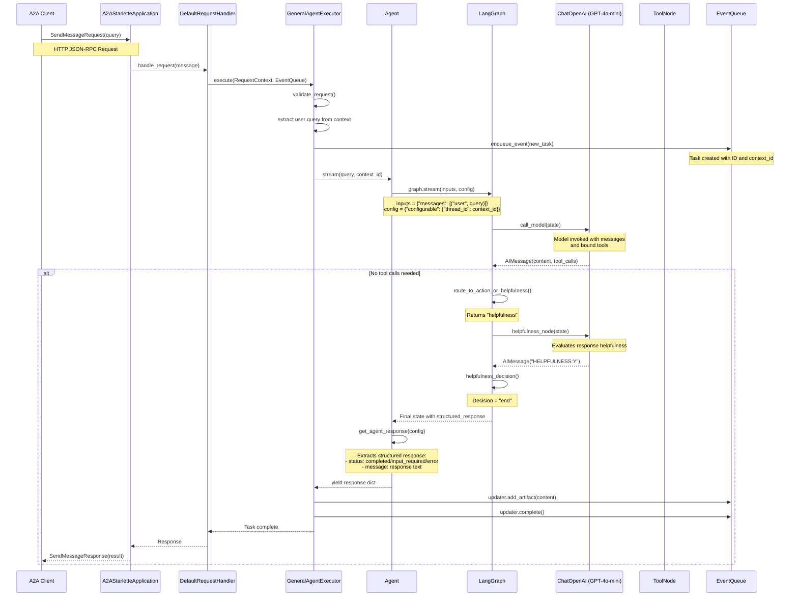
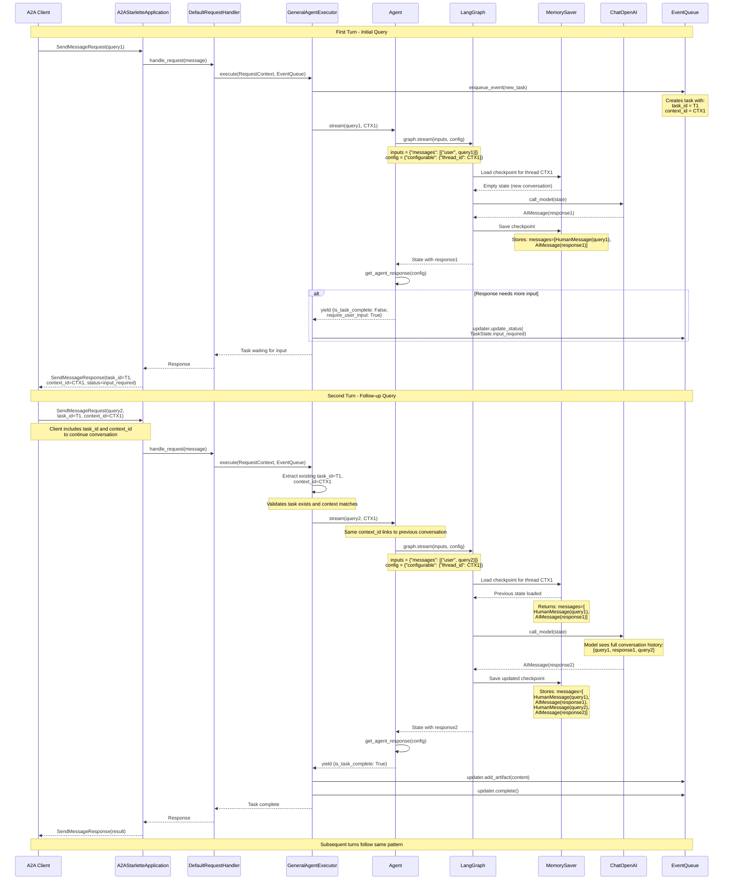
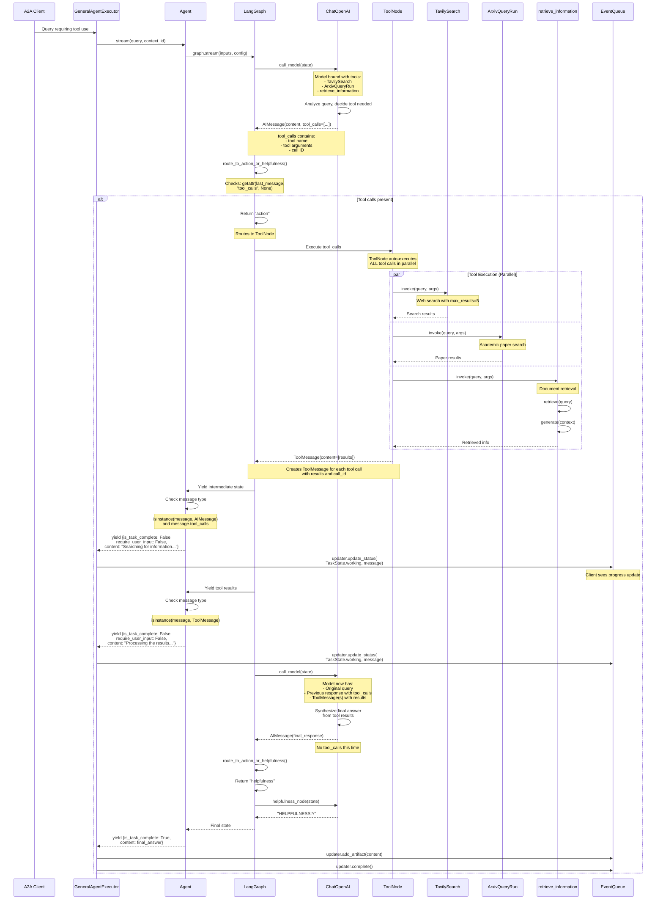
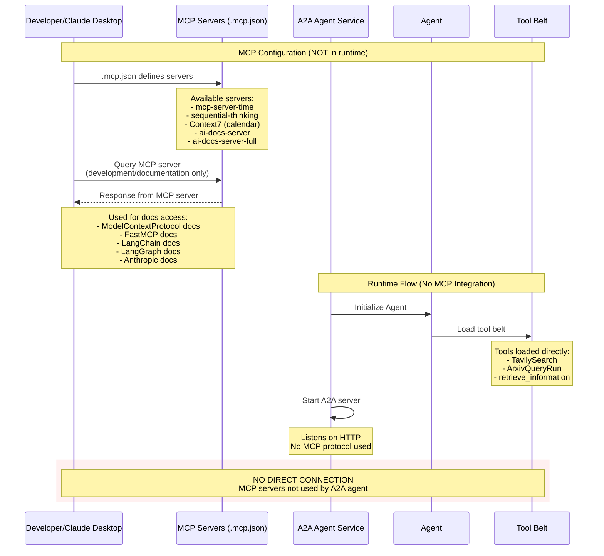

# Data Flow Analysis

This document provides comprehensive sequence diagrams showing the data flows through the A2A Agent system. The system uses the Agent-to-Agent (A2A) protocol for communication, LangGraph for stateful workflow management, and various tools for information retrieval.

## Overview

The system follows a layered architecture:
- **Protocol Layer**: A2A protocol (DefaultRequestHandler) manages incoming requests
- **Adapter Layer**: GeneralAgentExecutor translates between A2A protocol and core agent
- **Core Layer**: Agent class orchestrates the LangGraph workflow
- **Graph Layer**: LangGraph manages state and routes between agent, tools, and helpfulness evaluation
- **Tool Layer**: External tools (TavilySearch, ArxivQueryRun, RAG) provide capabilities

---

## 1. Simple Query Flow

A basic request/response cycle where a client sends a single query and receives a response. This flow demonstrates the fundamental path through the system without multi-turn interaction.



**Key Steps:**

1. **Request Reception** (Lines: __main__.py:95-96, agent_executor.py:33-37)
   - Client sends A2A SendMessageRequest via HTTP JSON-RPC
   - A2AStarletteApplication receives and routes to DefaultRequestHandler
   - Handler invokes GeneralAgentExecutor.execute() with RequestContext and EventQueue

2. **Request Validation & Task Creation** (agent_executor.py:38-46)
   - Executor validates the request
   - Extracts user query from context
   - Creates new task with unique ID and context_id
   - Enqueues task creation event to EventQueue

3. **Agent Streaming** (agent.py:57-80)
   - Agent.stream() method invoked with query and context_id
   - Constructs inputs dictionary with user message
   - Creates config with thread_id for checkpointing (MemorySaver)
   - Streams through LangGraph workflow

4. **Model Invocation** (graph.py:108-137)
   - LangGraph calls _call_model node
   - Model is bound with tools (TavilySearch, ArxivQueryRun, retrieve_information)
   - Model generates response, potentially with tool_calls

5. **Direct Response Path** (No Tool Calls)
   - route_to_action_or_helpfulness() checks for tool_calls (graph.py:41-46)
   - If no tool_calls, routes to helpfulness_node
   - Helpfulness evaluator determines if response is adequate (graph.py:49-84)
   - Returns "HELPFULNESS:Y" if response is good, triggering end condition

6. **Response Formatting** (agent.py:82-111)
   - get_agent_response() extracts structured_response from state
   - Maps ResponseFormat status to A2A task states:
     - "completed" → is_task_complete=True
     - "input_required" → require_user_input=True
     - "error" → require_user_input=True with error message

7. **Event Queue Updates** (agent_executor.py:76-81)
   - TaskUpdater sends artifact with response content
   - Marks task as complete
   - EventQueue manages task state transitions

8. **Response Delivery**
   - Handler converts to A2A protocol format
   - Server sends SendMessageResponse back to client

---

## 2. Interactive Client Session Flow

Multi-turn conversation with state management, demonstrating how the system maintains context across multiple exchanges using LangGraph's MemorySaver checkpointer.



**Key Steps:**

1. **First Turn - Session Initialization** (agent_executor.py:42-50, agent.py:57-59)
   - Client sends initial query without task_id or context_id
   - Executor creates new task with unique task_id (T1) and context_id (CTX1)
   - Agent receives query with context_id for thread identification

2. **Memory Initialization** (agent.py:42-55, graph.py:102)
   - LangGraph uses MemorySaver as checkpointer
   - Config specifies thread_id = context_id (CTX1)
   - First lookup returns empty state (new conversation)

3. **First Response with State Persistence** (graph.py:108-137)
   - Model processes initial query
   - LangGraph automatically saves checkpoint after each node execution
   - Checkpoint stores full message list: [HumanMessage(query1), AIMessage(response1)]

4. **Response Status Determination** (agent.py:82-111)
   - Agent evaluates structured_response status
   - If status="input_required", signals multi-turn needed
   - Returns require_user_input=True to keep conversation open

5. **Client State Tracking** (test_client.py:160-169)
   - Client receives response with task_id and context_id
   - Must include these in subsequent requests to continue conversation
   - Example: task_id=T1, context_id=CTX1

6. **Second Turn - Context Restoration** (agent_executor.py:42-50)
   - Client includes task_id and context_id in follow-up request
   - Executor validates existing task and context match
   - Agent invoked with same context_id (CTX1)

7. **Memory Retrieval** (graph.py:102, agent.py:57-59)
   - Graph loads checkpoint for thread_id = CTX1
   - MemorySaver returns previous messages: [query1, response1]
   - New user message appended: [query1, response1, query2]

8. **Context-Aware Response** (graph.py:33-38)
   - Model receives full conversation history
   - Can reference previous exchanges and maintain context
   - Generates contextually appropriate response

9. **State Accumulation** (graph.py:19-23)
   - AgentState uses add_messages reducer
   - Messages accumulate in list, not overwrite
   - Updated checkpoint: [query1, response1, query2, response2]

10. **Session Continuation**
    - Process repeats for each turn
    - Same context_id maintains conversation thread
    - MemorySaver persists state across turns
    - Conversation ends when is_task_complete=True

**State Management Details:**
- **Thread ID**: context_id serves as unique conversation identifier
- **Checkpointer**: MemorySaver stores in-memory state (graph.py:15)
- **State Schema**: AgentState TypedDict with messages and structured_response (graph.py:19-23)
- **Message Accumulation**: add_messages reducer appends new messages to list
- **Persistence Scope**: State persists for duration of server process (in-memory)

---

## 3. Tool Permission Callback Flow

This system uses automatic tool execution without explicit permission callbacks. Tools are pre-approved and executed automatically when the model requests them. This section documents the actual tool execution flow.



**Key Steps:**

1. **Tool Binding** (graph.py:26-30, tools.py:15-18)
   - Model bound with three tools at initialization:
     - TavilySearch: Web search (max_results=5)
     - ArxivQueryRun: Academic paper search
     - retrieve_information: RAG document retrieval
   - Tools are pre-approved, no runtime permission needed

2. **Tool Call Decision** (graph.py:33-38)
   - Model analyzes query and decides if tools are needed
   - Returns AIMessage with tool_calls attribute
   - tool_calls contains: name, args, id for each tool

3. **Routing Logic** (graph.py:41-46)
   - route_to_action_or_helpfulness() checks for tool_calls
   - If present: routes to "action" (ToolNode)
   - If absent: routes to "helpfulness" evaluation

4. **Automatic Tool Execution** (graph.py:144)
   - ToolNode created from get_tool_belt()
   - ToolNode automatically executes all tool_calls
   - No human-in-the-loop or permission callback
   - Execution is parallel for multiple tools

5. **Progress Updates** (agent.py:64-78)
   - Agent yields intermediate progress messages
   - For AIMessage with tool_calls: "Searching for information..."
   - For ToolMessage: "Processing the results..."
   - Executor updates task status to TaskState.working

6. **Tool Result Integration** (graph.py:144, 161)
   - ToolNode returns ToolMessage with results
   - Graph adds edge from "action" back to "agent"
   - Model invoked again with tool results in context

7. **Synthesis** (graph.py:33-38)
   - Model generates final answer using tool results
   - Typically doesn't make more tool_calls
   - Routes to helpfulness evaluation

8. **RAG Tool Details** (rag_graph.py:115-125)
   - retrieve_information is a @tool decorated function
   - Uses internal LangGraph for RAG workflow
   - Steps: retrieve documents → generate answer
   - Returns synthesized response, not raw documents

**No Permission Callbacks:**
- Tools execute automatically when model requests them
- No user approval step in the flow
- No callback mechanism to approve/reject tools
- This is a trust-based design where tools are pre-vetted
- For permission-based execution, would need:
  - Hook before ToolNode execution
  - Pause graph execution
  - Request user approval
  - Resume or cancel based on response

**Tool Configuration Sources:**
- tools.py: Tool belt assembly (lines 15-18)
- graph.py: Tool binding and ToolNode creation (lines 26-30, 144)
- rag_graph.py: RAG tool implementation (lines 115-125)
- __main__.py: Agent skills declared for A2A card (lines 49-71)

---

## 4. MCP Server Communication Flow

The Model Context Protocol (MCP) is configured for the development environment but **NOT used in the main application runtime**. MCP servers are available for documentation purposes during development via Claude Desktop or similar MCP clients, but the A2A agent service does not integrate with MCP servers.



**Key Points:**

1. **MCP Configuration File** (.mcp.json:1-87)
   - Defines 5 MCP servers for development use
   - Located in project root
   - Used by MCP clients (Claude Desktop, etc.)

2. **MCP Servers Available:**
   - **mcp-server-time**: Time/timezone utilities
   - **sequential-thinking**: Reasoning framework
   - **Context7**: Calendar integration (CalCom API)
   - **ai-docs-server**: Quick documentation access (LangChain, LangGraph, Anthropic, MCP, FastMCP)
   - **ai-docs-server-full**: Full documentation access

3. **MCP NOT Used in Runtime:**
   - Main application (__main__.py) does not initialize MCP clients
   - Agent (agent.py) does not reference MCP
   - Tools (tools.py) loaded directly, not through MCP
   - A2A protocol used for client-server communication, not MCP

4. **Why MCP Config Exists:**
   - Provides documentation access during development
   - Developers can use Claude Desktop with MCP for:
     - Querying LangChain/LangGraph documentation
     - Understanding MCP protocol itself
     - Time utilities for development
   - Not part of production runtime

5. **Actual Tool Integration:**
   - Tools integrated via LangChain Tool interface
   - Direct Python imports: TavilySearch, ArxivQueryRun
   - RAG tool defined locally with @tool decorator
   - No MCP protocol wrapping or translation

6. **To Add MCP Integration (Future):**
   - Would require MCP client library
   - Connect to MCP servers via stdio/SSE transport
   - Translate MCP tool definitions to LangChain tools
   - Add MCP server lifecycle management
   - Current design: simpler, direct tool integration

**References:**
- MCP config: .mcp.json (root)
- Tool loading: a2a_service/core/tools.py (lines 15-18)
- Agent initialization: a2a_service/core/agent.py (lines 42-55)
- Server startup: a2a_service/__main__.py (lines 85-99)

---

## 5. Message Parsing and Routing

How incoming A2A protocol messages are parsed and routed through the handler, executor, agent, and graph layers.

```mermaid
sequenceDiagram
    participant Client as A2A Client
    participant HTTP as HTTP Layer
    participant App as A2AStarletteApplication
    participant Handler as DefaultRequestHandler
    participant Store as InMemoryTaskStore
    participant Executor as GeneralAgentExecutor
    participant Context as RequestContext
    participant Agent as Agent
    participant Graph as LangGraph
    participant Router as Routing Logic

    Note over Client,Router: 1. HTTP Request Reception

    Client->>HTTP: POST /jsonrpc
    Note over Client,HTTP: JSON-RPC 2.0 request:<br/>{<br/>  "jsonrpc": "2.0",<br/>  "method": "send_message",<br/>  "params": {...},<br/>  "id": "req-123"<br/>}

    HTTP->>App: Starlette receives request
    App->>App: Parse JSON-RPC envelope
    Note over App: Extracts:<br/>- method name<br/>- params<br/>- request id

    App->>App: Validate A2A protocol
    Note over App: Checks:<br/>- Valid JSON-RPC 2.0<br/>- Supported method<br/>- Required fields present

    Note over Client,Router: 2. Message Parsing

    App->>Handler: route to http_handler
    Note over App,Handler: DefaultRequestHandler<br/>registered at server init

    Handler->>Handler: Parse MessageSendParams
    Note over Handler: Extracts from params:<br/>- message.role (user/agent)<br/>- message.parts (text/data)<br/>- message.message_id<br/>- message.task_id (optional)<br/>- message.context_id (optional)

    Handler->>Context: Create RequestContext
    Note over Context: RequestContext wraps:<br/>- Parsed message<br/>- Current task (if exists)<br/>- Session info

    alt Existing task continuation
        Handler->>Store: Lookup task by task_id
        Store-->>Handler: Return existing task
        Note over Handler,Store: Validates:<br/>- task_id exists<br/>- context_id matches<br/>- task not cancelled
        Handler->>Context: Attach current_task
    else New conversation
        Note over Handler: No task_id provided<br/>Will create new task
    end

    Note over Client,Router: 3. Content Extraction and Routing

    Handler->>Executor: execute(RequestContext, EventQueue)

    Executor->>Context: get_user_input()
    Note over Executor,Context: Extracts text from message.parts

    Context->>Context: Iterate through parts
    Note over Context: parts can be:<br/>- TextPart (text content)<br/>- DataPart (binary/structured)<br/>- Mixed (multiple parts)

    Context->>Context: Find first TextPart
    Context-->>Executor: Return text content

    Executor->>Executor: Validate request
    Note over Executor: Currently minimal validation<br/>(returns False = no error)

    alt New task creation
        Executor->>Executor: new_task(message)
        Note over Executor: Creates Task with:<br/>- Unique task_id<br/>- Unique context_id<br/>- Initial state: working
        Executor->>Store: Store task
        Executor->>Handler: Enqueue task event
    end

    Note over Client,Router: 4. Agent Graph Routing

    Executor->>Agent: stream(query, context_id)
    Note over Executor,Agent: Query = extracted text<br/>context_id = task.context_id

    Agent->>Graph: graph.stream(inputs, config)
    Note over Agent,Graph: inputs = {"messages": [("user", query)]}<br/>config = {"configurable": {"thread_id": context_id}}

    Graph->>Graph: Load from checkpoint
    Note over Graph: Restores previous messages<br/>if context_id seen before

    Graph->>Router: Start from entry point "agent"
    Note over Router: Entry point defined in<br/>graph.set_entry_point("agent")

    Router->>Router: Execute "agent" node
    Note over Router: Calls _call_model(state)

    Router->>Router: route_to_action_or_helpfulness()
    Note over Router: Decision point:<br/>- Check if tool_calls present<br/>- Route to "action" or "helpfulness"

    alt Tool calls present
        Router->>Router: Route to "action" node
        Note over Router: Edge: agent -> action
        Router->>Router: Execute ToolNode
        Router->>Router: Route back to "agent"
        Note over Router: Edge: action -> agent
    else No tool calls
        Router->>Router: Route to "helpfulness" node
        Note over Router: Edge: agent -> helpfulness
        Router->>Router: Execute helpfulness evaluation
        Router->>Router: helpfulness_decision()

        alt Helpful response
            Router->>Router: Route to END
            Note over Router: Conversation complete
        else Not helpful
            Router->>Router: Route back to "agent"
            Note over Router: Continue loop (max 10 messages)
        end
    end

    Note over Client,Router: 5. Response Marshaling

    Graph-->>Agent: Final state
    Agent->>Agent: get_agent_response(config)
    Note over Agent: Extracts structured_response:<br/>- ResponseFormat.status<br/>- ResponseFormat.message

    Agent->>Agent: Map to A2A task state
    Note over Agent: Mapping:<br/>- completed → is_task_complete=True<br/>- input_required → require_user_input=True<br/>- error → require_user_input=True

    Agent-->>Executor: yield response dict

    Executor->>Executor: Update task state
    alt Task complete
        Executor->>Store: updater.add_artifact(content)
        Executor->>Store: updater.complete()
        Note over Store: Task state → completed
    else Input required
        Executor->>Store: updater.update_status(<br/>TaskState.input_required)
        Note over Store: Task state → input_required
    end

    Executor-->>Handler: Task update complete
    Handler->>Handler: Build A2A response
    Note over Handler: Creates SendMessageResponse:<br/>- result.id (task_id)<br/>- result.context_id<br/>- result.state<br/>- result.artifacts

    Handler-->>App: Return response
    App->>App: Wrap in JSON-RPC envelope
    Note over App: {<br/>  "jsonrpc": "2.0",<br/>  "result": {...},<br/>  "id": "req-123"<br/>}

    App-->>HTTP: HTTP 200 OK
    HTTP-->>Client: Response body
```



**Key Steps:**

1. **HTTP Request Reception** (__main__.py:95-99)
   - A2AStarletteApplication listens on configured host:port
   - Built on Starlette ASGI framework
   - Accepts POST requests to /jsonrpc endpoint
   - JSON-RPC 2.0 protocol used for message framing

2. **Protocol Parsing** (__main__.py:89-94)
   - DefaultRequestHandler registered as http_handler
   - Parses JSON-RPC envelope: method, params, id
   - Validates A2A protocol compliance
   - Supported method: "send_message"

3. **Message Structure Parsing** (agent_executor.py:33-42)
   - MessageSendParams extracted from params
   - Key fields parsed:
     - message.role: "user" or "agent"
     - message.parts: List[Part] (text, data, or mixed)
     - message.message_id: Unique message identifier
     - message.task_id: Optional, links to existing task
     - message.context_id: Optional, maintains conversation thread

4. **Task Lookup and Context Creation** (agent_executor.py:43-46)
   - If task_id provided: lookup in InMemoryTaskStore
   - Validates task exists and context_id matches
   - Creates RequestContext wrapper with current_task
   - If no task_id: will create new task

5. **Content Extraction** (agent_executor.py:42)
   - RequestContext.get_user_input() extracts text
   - Iterates through message.parts
   - Finds first TextPart and returns text content
   - Ignores DataPart (not used in current implementation)

6. **Agent Graph Input Preparation** (agent.py:57-59)
   - Constructs inputs dictionary: {"messages": [("user", query)]}
   - Creates config with thread_id for MemorySaver: {"configurable": {"thread_id": context_id}}
   - context_id serves as conversation thread identifier

7. **Graph Entry and Routing** (graph.py:143-163)
   - Entry point set to "agent" node
   - graph.stream() yields state after each node execution
   - Routing logic:
     - **agent node** → route_to_action_or_helpfulness()
     - **If tool_calls** → "action" (ToolNode)
     - **If no tool_calls** → "helpfulness" evaluation
     - **action** → always returns to "agent"
     - **helpfulness** → "end" (if Y) or "continue" (if N, back to agent)

8. **Conditional Routing Logic** (graph.py:41-46, 87-99)
   - route_to_action_or_helpfulness(): Checks last_message.tool_calls
   - helpfulness_decision(): Checks for "HELPFULNESS:Y" or "HELPFULNESS:END"
   - Loop guard: Max 10 messages to prevent infinite loops

9. **State Streaming** (agent.py:61-78)
   - Graph streams state after each node
   - Agent yields progress updates based on message type:
     - AIMessage with tool_calls → "Searching for information..."
     - ToolMessage → "Processing the results..."
     - Final state → Actual response content

10. **Response Formatting** (agent.py:82-111)
    - get_agent_response() extracts structured_response
    - ResponseFormat Pydantic model defines:
      - status: Literal["input_required", "completed", "error"]
      - message: str (response text)
    - Maps to A2A task state:
      - completed → is_task_complete=True, require_user_input=False
      - input_required → is_task_complete=False, require_user_input=True
      - error → is_task_complete=False, require_user_input=True

11. **Task State Updates** (agent_executor.py:55-81)
    - TaskUpdater manages EventQueue updates
    - State transitions:
      - working → Progress updates during tool execution
      - input_required → Waiting for user response
      - completed → Task finished, artifact added
    - Artifacts stored as Part(root=TextPart(text=...))

12. **Response Marshaling**
    - Handler converts to A2A SendMessageResponse
    - Includes task_id, context_id, state, artifacts
    - App wraps in JSON-RPC envelope with request id
    - Returns HTTP 200 with JSON body

**Message Part Types:**
- **TextPart**: Plain text content (most common)
- **DataPart**: Binary or structured data (not used in current flows)
- **Mixed**: Multiple parts in single message (supported but rare)

**Routing Decision Points:**
- **Entry**: Always starts at "agent" node (graph.py:149)
- **Agent → Action/Helpfulness**: Based on tool_calls presence (graph.py:41-46)
- **Helpfulness → End/Continue**: Based on evaluation result (graph.py:87-99)
- **Action → Agent**: Always returns for synthesis (graph.py:161)

**Error Handling:**
- Invalid request → ServerError with InvalidParamsError (agent_executor.py:38-40)
- Stream exception → ServerError with InternalError (agent_executor.py:83-85)
- Unsupported operation (cancel) → UnsupportedOperationError (agent_executor.py:90-93)

---

## Data Flow Summary

### Request Processing Pipeline

```
Client → HTTP → A2AStarletteApp → DefaultRequestHandler → GeneralAgentExecutor → Agent → LangGraph → Model/Tools
```

### Key Data Transformations

1. **HTTP → A2A Protocol**
   - JSON-RPC envelope → MessageSendParams
   - Handled by A2AStarletteApplication

2. **A2A Protocol → Agent Input**
   - MessageSendParams → text query string
   - RequestContext.get_user_input() extracts text from parts

3. **Agent Input → Graph Input**
   - text query → {"messages": [("user", query)]}
   - context_id → {"configurable": {"thread_id": context_id}}

4. **Graph State → Agent Response**
   - AgentState.structured_response → response dict
   - ResponseFormat (status, message) → (is_task_complete, require_user_input, content)

5. **Agent Response → A2A Protocol**
   - response dict → Task artifacts and state
   - TaskUpdater manages EventQueue updates

6. **A2A Protocol → HTTP**
   - SendMessageResponse → JSON-RPC result
   - Wrapped by A2AStarletteApplication

### State Management

- **Session State**: Maintained by MemorySaver with thread_id = context_id
- **Task State**: Managed by InMemoryTaskStore with task_id
- **Message History**: Accumulated in AgentState.messages with add_messages reducer
- **Checkpointing**: Automatic after each graph node execution

### Concurrency Model

- **Request Handling**: Async/await throughout the stack
- **Tool Execution**: ToolNode executes multiple tool_calls in parallel
- **Streaming**: Generator pattern with async iteration (Agent.stream())
- **Event Queue**: Async queue for task state updates

### Component Interactions Summary

| Source Component | Target Component | Interface | Data Format |
|-----------------|------------------|-----------|-------------|
| A2A Client | A2AStarletteApplication | HTTP JSON-RPC | SendMessageRequest |
| A2AStarletteApplication | DefaultRequestHandler | Python method call | RequestContext |
| DefaultRequestHandler | GeneralAgentExecutor | execute() method | RequestContext, EventQueue |
| GeneralAgentExecutor | Agent | stream() method | query: str, context_id: str |
| Agent | LangGraph | stream() method | inputs: dict, config: dict |
| LangGraph | ChatOpenAI | invoke() method | messages: List[BaseMessage] |
| LangGraph | ToolNode | invoke() method | state: AgentState |
| ToolNode | Tools | invoke() method | query: str, args: dict |
| Tools | ToolNode | return value | str or dict |
| LangGraph | Agent | generator yield | state: AgentState |
| Agent | GeneralAgentExecutor | generator yield | dict (is_task_complete, content) |
| GeneralAgentExecutor | EventQueue | enqueue_event() | Task, TaskUpdate |
| GeneralAgentExecutor | DefaultRequestHandler | return | None (updates via EventQueue) |
| DefaultRequestHandler | A2AStarletteApplication | return | SendMessageResponse |
| A2AStarletteApplication | A2A Client | HTTP response | JSON-RPC result |

---

## File References

### Primary Data Flow Files

- **a2a_service/__main__.py** (Lines 1-114): Server initialization, A2A protocol setup
- **a2a_service/adapters/agent_executor.py** (Lines 1-94): Protocol adapter, task management
- **a2a_service/core/agent.py** (Lines 1-114): Agent orchestration, streaming interface
- **a2a_service/core/graph.py** (Lines 1-164): LangGraph workflow definition, routing logic
- **a2a_service/core/tools.py** (Lines 1-19): Tool belt assembly
- **a2a_service/core/rag_graph.py** (Lines 1-126): RAG tool implementation
- **a2a_client_examples/test_client.py** (Lines 1-199): Client usage examples

### Configuration Files

- **.mcp.json** (Lines 1-87): MCP server configuration (development only)
- **.env**: Environment variables (API keys, model names)

### Key Dependencies

- **a2a.server**: A2A protocol implementation (external package)
- **langchain_openai**: ChatOpenAI model integration
- **langgraph**: Stateful graph workflow engine
- **langchain_community**: TavilySearch, ArxivQueryRun tools
- **pydantic**: Data validation (ResponseFormat)

---

## Conclusion

This data flow analysis demonstrates a well-structured layered architecture:

1. **Protocol Layer** handles A2A-compliant request/response formatting
2. **Adapter Layer** translates between A2A and internal agent interface
3. **Core Agent Layer** orchestrates the workflow and manages state
4. **Graph Layer** implements the actual reasoning loop with tool use and helpfulness evaluation
5. **Tool Layer** provides external capabilities (web search, academic search, RAG)

The system uses streaming for responsiveness, automatic checkpointing for state persistence, and clear separation of concerns between layers. Tools execute automatically without permission callbacks, and MCP is not integrated in the runtime (only used for development documentation access).

